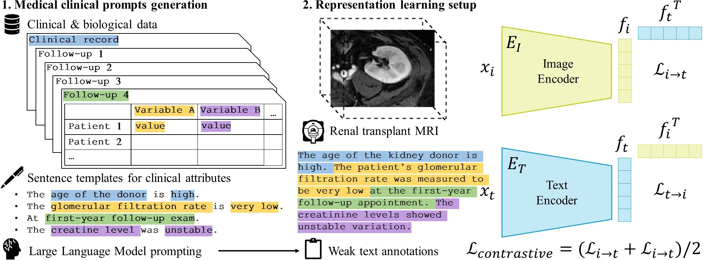

# MEDIMP: Medical Images and Prompts for renal transplant representation learning
Source code for "MEDIMP: Medical Images and Prompts for renal transplant representation learning", MIDL 2023.

<p align="center">
  
</p>

# Soon to come ...

# Dummy dataset
As the dataset for this work is not publicly available, I built a dummy mri dataset path tree similar to our dataset so that the code can be ran on it, when argument ```dummy=True``` in ```get_patient_seq_paths``` function.
```bash
├── data
│   ├── dummy_dataframes
│   │   ├── df_targets.csv
│   ├── dummy_mri_dataset (contains patients)
│   │   ├── dummy_mri.nii.gz
│   │   ├── 001-0001-A-A (contains exams)
│   │   │   ├── D15 (contains MRI sequences)
│   │   │   │   ├── 1_WATER_AX_LAVA-Flex_ss_IV
│   │   │   │   ├── 2_WATER_AX_LAVA-Flex_ART
│   │   │   │   ├── 3_WATER_AX_LAVA-Flex_tub
│   │   │   ├── D30
│   │   │   ├── M3
│   │   │   ├── M12
│   │   ├── 001-0002-B-B
│   │   ├── ...
└── ...
```

# Requirements
See conda_environment.yml file or replicate the conda env:
```
conda env create -n ENVNAME --file conda_environment.yml
```

# References
```
@misc{milecki2023medimp,
      title={MEDIMP: Medical Images and Prompts for renal transplant representation learning}, 
      author={Leo Milecki and Vicky Kalogeiton and Sylvain Bodard and Dany Anglicheau and Jean-Michel Correas and Marc-Olivier Timsit and Maria Vakalopoulou},
      year={2023},
      eprint={2303.12445},
      archivePrefix={arXiv},
      primaryClass={cs.CV}
}
```
